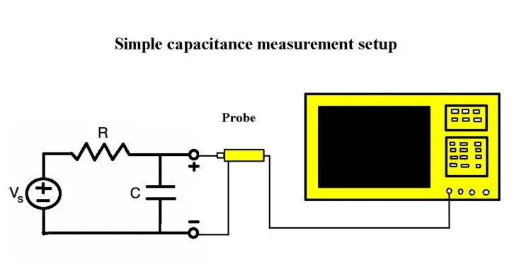

<h1>Aula 12</h1>

En esta clase se presentan el manejo del generador de señales y del osciloscopio

<h2>Generador de señales</h2>

Un generador de señales es un equipo de prueba que permite generar señales eléctricas en DC con diferentes formas de onda (senoidales, cuadradas, triangulares, entre otras). Para usar un generador de señales se debe tener en cuenta:

1. Seleccionar el tipo de señal (AC o DC) que se desea generar.
2. Configurar la frecuencia y la amplitud de la señal.

 
<figcaption>Fuente: https://diotronic.com/generadores-de-funciones/5214-generador-funciones-3-mhz</figcaption>
 

<h2>Osciloscopio</h2>

El osciloscopio es un instrumento de medición mediante gráficas, el cual mide diferentes señales eléctricas, las cuales pueden ser analizadas por medio de la gráfica, tales como:

1. El voltaje pico a pico (Vpp), el voltaje de pico (Vp) y el voltaje eficaz (Vrms).
2. El periodo, la frecuencia, los tiempos de subida y bajada de las señales.
3. El desfase entre dos señales.

 
<figcaption>Fuente: https://i.ebayimg.com/00/s/MTAwMFgxMDAw/z/UaUAAOSw9T1emd73/$_57.JPG?set_id=8800005007</figcaption>
 

*El <i>trigger</i> es un disparador (flanco o pulsos) del osciloscopio que estabiliza una señal a partir de la captura de dicha señal, generando una imagen estática en la pantalla. En algunos osciloscopios debe estar activado el modo single, el cual genera un pantallazo de la forma de onda que se está visualizando.

<h3>Calibración</h3>

Como buena práctica, antes de realizar una medición con el osciloscopio se debe calibrar a partir de la señal por defecto que trae consigo el instrumento de medida. Para esto se deben realizar los siguientes pasos:

1. Conectar la sonda al conector de prueba de la señal de referencia
2. Calibrar el <i>trigger</i> de la sonda si la forma de onda de la señal no es estática
3. Calibrar las escalas horizontal y vertical

 
<figcaption>Fuente: https://www.youtube.com/watch?v=rxQChWP2jqQ</figcaption>
 

* En los osciloscopios digitales solamente se debe conectar la sonda al conector de prueba de la señal de referencia y presionar el botón <i>auto set</i>.

<h3>Medir voltaje</h3>

1. Conectar la sonda del osciloscopio al punto de medición del circuito.
2. Conectar el conector de masa del osciloscopio al punto de tierra común del circuito.
2. Ajustar la escala vertical (amplitud) para que la señal se vea claramente en la pantalla.
3. Ajustar la escala horizontal (tiempo) para observar la forma de onda del voltaje.
4. Leer y analizar la medición de voltaje directamente de la pantalla del osciloscopio.

 
<figcaption>Fuente: https://www.testandmeasurementtips.com/using-oscilloscope-find-unknown-capacitance/</figcaption>
 

<h3>Medir tiempo y frecuencia</h3>

1. Usar la función de mediciones para medir el periodo, la frecuencia, voltaje pico a pico, voltajes máximo y mínimo, voltaje RMS.
2. Usar la función cursor para medir los tiempos entre flancos.

 
<figcaption>Fuente: https://personales.upv.es/jogomez/labvir/material/osciloscopio.htm</figcaption>
 

<h2>Osciloscopio y generador de señales</h2>

 
<figcaption>Fuente: https://gatogenerator.blogspot.com/2010/09/un-generador-de-funciones-es-un-aparato.html</figcaption>
 

