<h1>Aula 2</h1>

En esta clase se presenta el manejo del multímetro y del protoboard

<h2>Resistencias</h2>

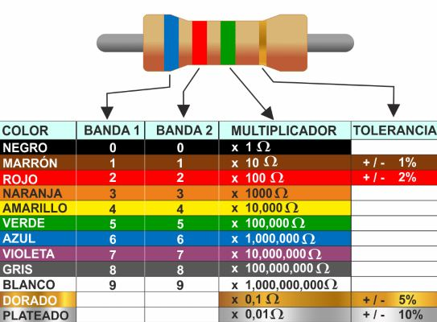
 
<figcaption>Fuente: https://ingenieromenargues.blogspot.com/2019/12/codigo-colores-de-resistencias.html</figcaption>

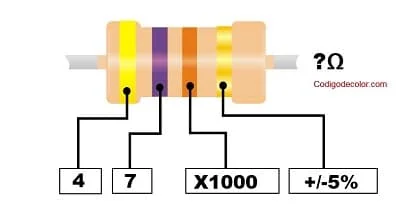
 
<figcaption>Fuente: https://codigodecolor.com/electronica/calcular-el-valor-de-resistencias/</figcaption>

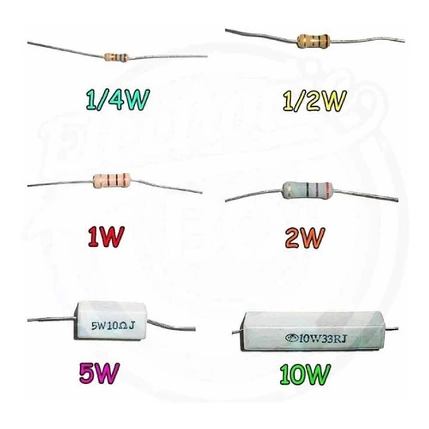
 
<figcaption>Fuente: https://electrosena.mercadoshops.com.co/MCO-558439280-resistencia-de-100-ohm-2-w-watts-_JM</figcaption>

<h3>% Error resistencias</h3>

$$Error = (|R_{teórica}-R_{medida}|) \cdot (100/R_{teórica}) $$

<h2>Ley de Ohm</h2>

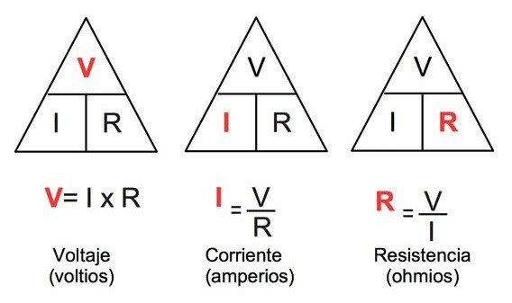
 
<figcaption>Fuente: https://www.todamateria.com/ley-de-ohm/</figcaption>

<h2>Potencia</h2>

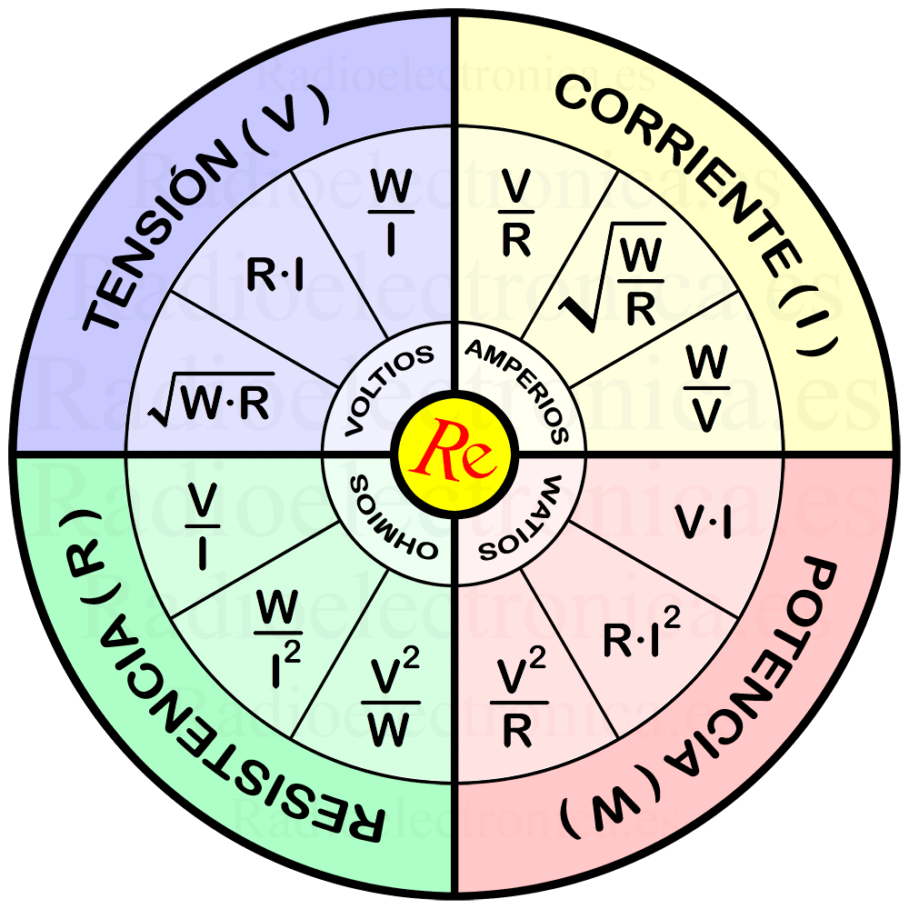
 
<figcaption>Fuente: https://www.postposmo.com/ley-de-ohm/</figcaption>

<h2>Multímetro</h2>

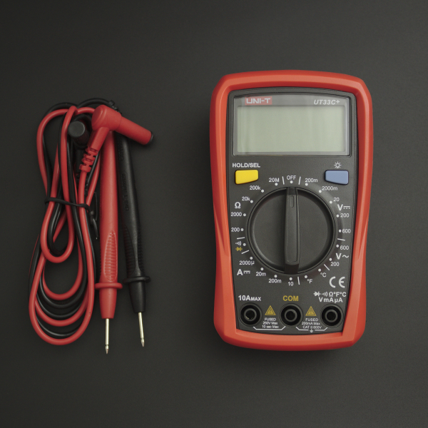
 
<figcaption>Fuente: https://www.vistronica.com/blog/post/medir-corriente</figcaption>

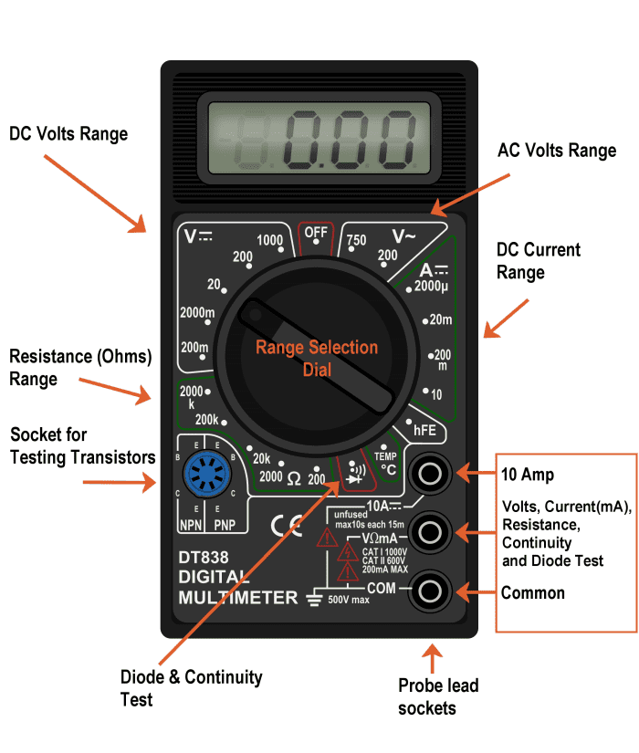
 
<figcaption>Fuente: https://owlcation.com/stem/Using-a-Multimeter</figcaption>

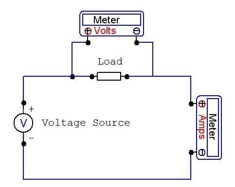
 
<figcaption>Fuente: https://owlcation.com/stem/Using-a-Multimeter</figcaption>

<h3>Medir resistencia</h3>

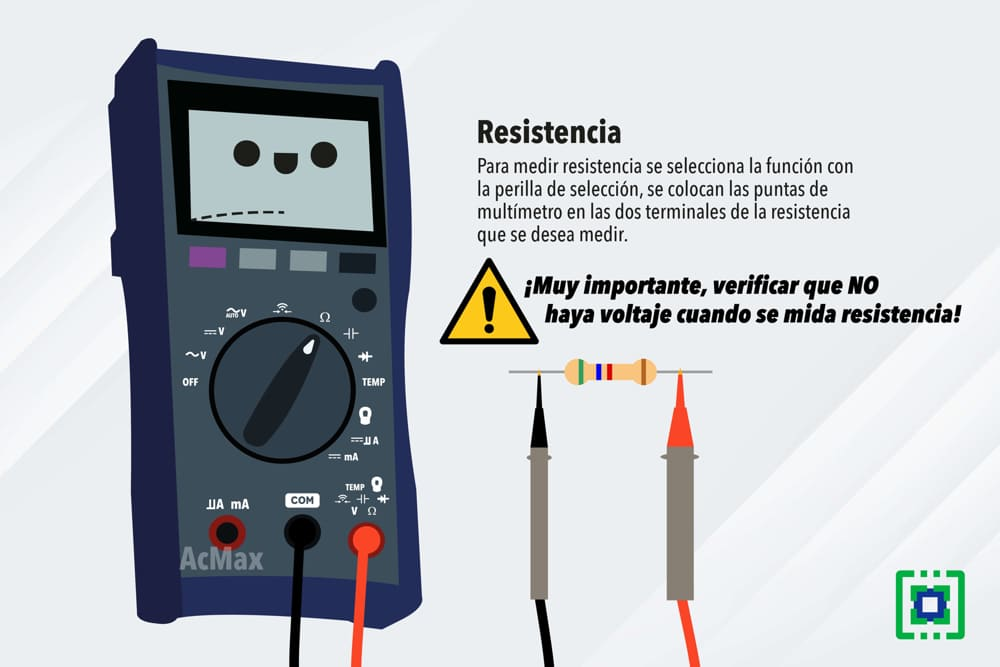
 
<figcaption>Fuente: https://electropreguntas.com/como-se-usa-un-multimetro-para-medir-la-resistencia/</figcaption>

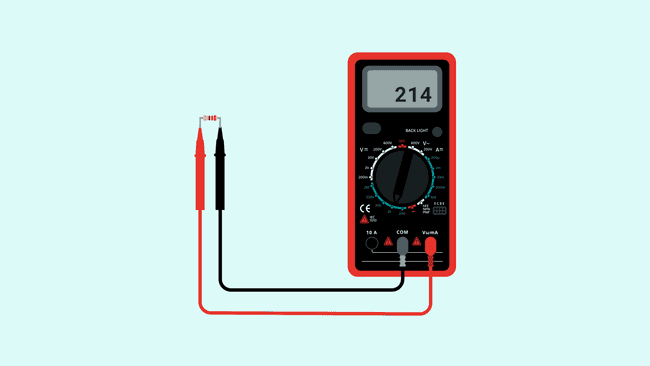
 
<figcaption>Fuente: https://docs.arduino.cc/learn/electronics/multimeter-basics/</figcaption>

<h3>Medir voltaje</h3>

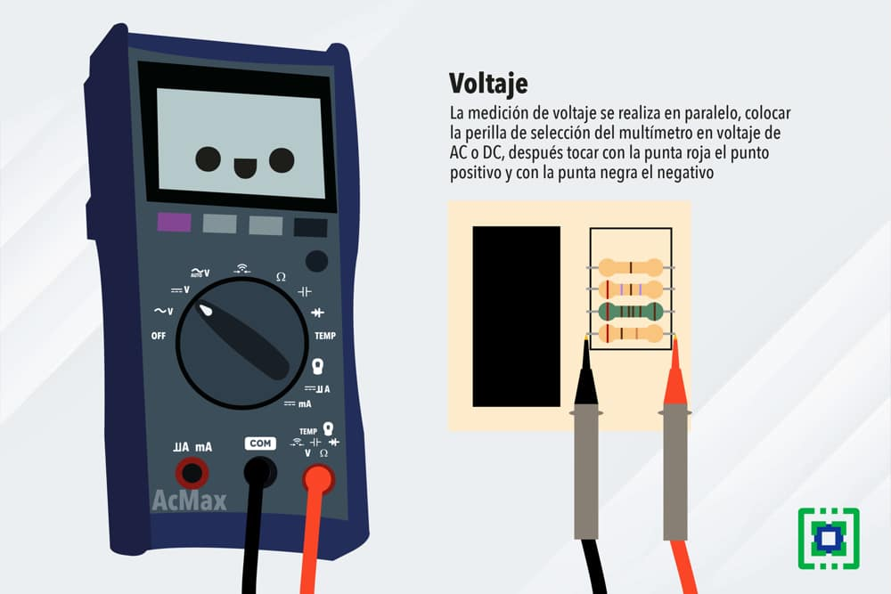
 
<figcaption>Fuente: https://electropreguntas.com/como-se-mide-el-voltaje-con-un-multimetro-digital/</figcaption>

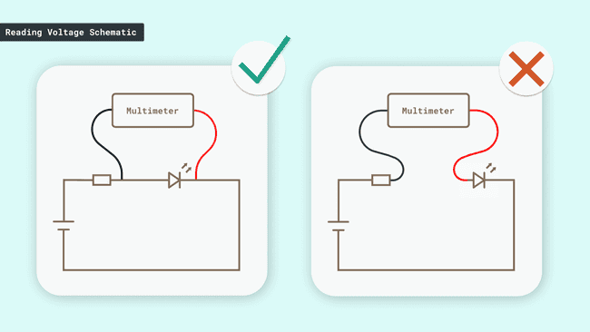
 
<figcaption>Fuente: https://docs.arduino.cc/learn/electronics/multimeter-basics/</figcaption>

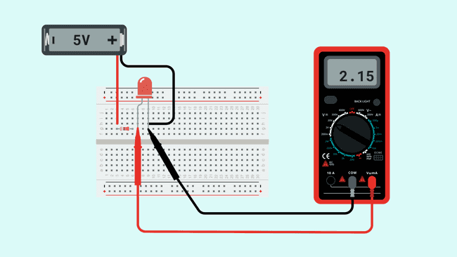
 
<figcaption>Fuente: https://docs.arduino.cc/learn/electronics/multimeter-basics/</figcaption>

<h3>Medir corriente</h3>

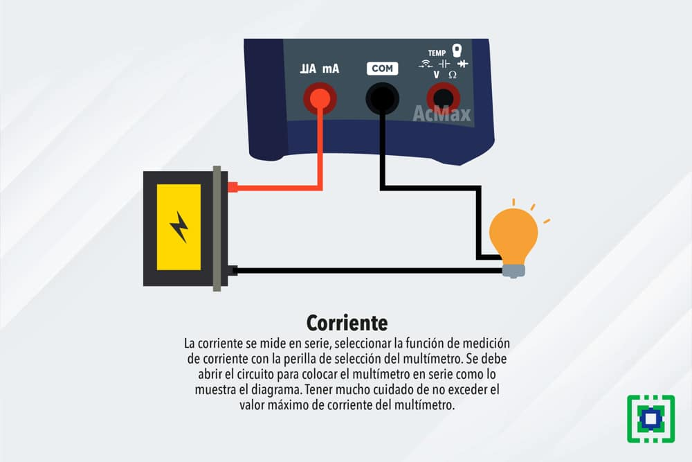
 
<figcaption>Fuente: https://electropreguntas.com/como-se-usa-un-multimetro-para-medir-la-corriente/</figcaption>

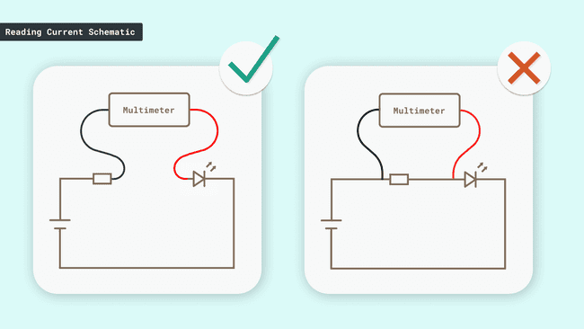
 
<figcaption>Fuente: https://docs.arduino.cc/learn/electronics/multimeter-basics/</figcaption>

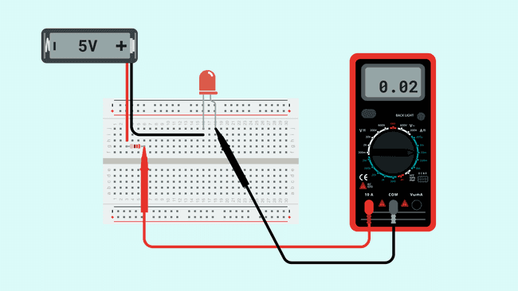
 
<figcaption>Fuente: https://docs.arduino.cc/learn/electronics/multimeter-basics/</figcaption>

<h3>Medir continuidad</h3>

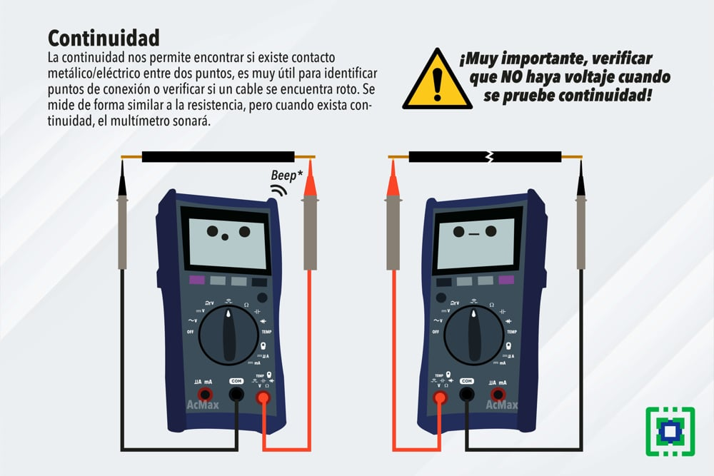
 
<figcaption>Fuente: https://electropreguntas.com/como-se-mide-la-continuidad-con-un-multimetro/</figcaption>

<h2>Protoboard</h2>

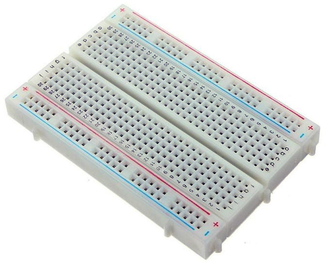
 
<figcaption>Fuente: https://portalacademico.cch.unam.mx/cibernetica1/implementacion-de-circuitos-logicos/tableta-protoboard</figcaption>

<h3>Contactos</h3>

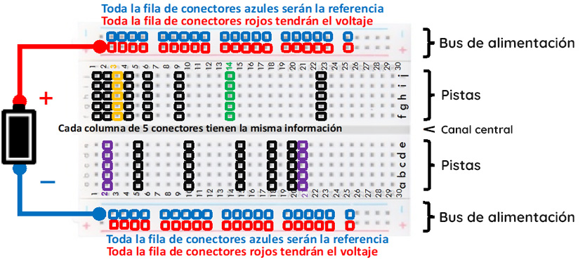
 
<figcaption>Fuente: https://portalacademico.cch.unam.mx/cibernetica1/implementacion-de-circuitos-logicos/tableta-protoboard</figcaption>

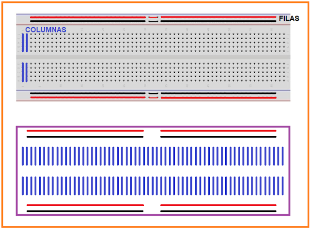
 
<figcaption>Fuente: https://www.tecnologiaypedagogia.net/2009/09/practicas-de-electronica-basica.html</figcaption>

<h3>Conexiones</h3>

Para comenzar a realizar conexiones sobre protoboard es válido utilizar simuladores como Fritzing, <a href="https://www.tinkercad.com/things/hNhkacFMO2w-switch-on-led">Tinkercad</a>, entre otros.

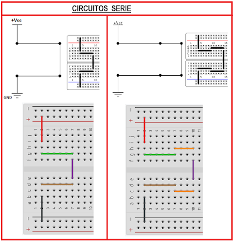
 
<figcaption>Fuente: https://www.tecnologiaypedagogia.net/2009/09/practicas-de-electronica-basica.html</figcaption>

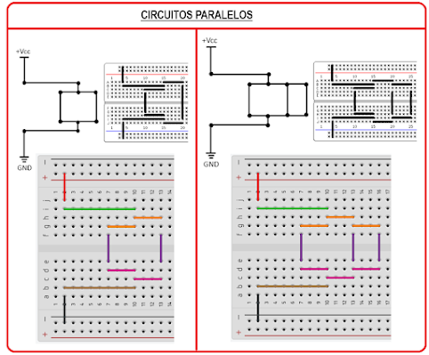
 
<figcaption>Fuente: https://www.tecnologiaypedagogia.net/2009/09/practicas-de-electronica-basica.html</figcaption>

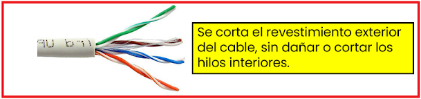
 
<figcaption>Fuente: https://www.tecnologiaypedagogia.net/2009/09/practicas-de-electronica-basica.html</figcaption>

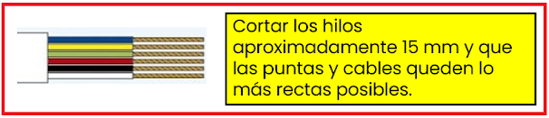
 
<figcaption>Fuente: https://www.tecnologiaypedagogia.net/2009/09/practicas-de-electronica-basica.html</figcaption>

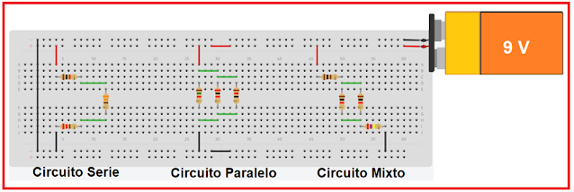
 
<figcaption>Fuente: https://www.tecnologiaypedagogia.net/2009/09/practicas-de-electronica-basica.html</figcaption>

