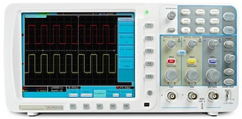

<h1 align="center">Profesor: MSc. Fabián Barrera Prieto 👨‍🏫 
Materia: Laboratorio de circuitos ⚡ 
Universidad: UMNG 🏫 
Año: 2025 📅</h1> 

El laboratorio de circuitos está enfocado al desarrollo de circuitos electrónicos y al manejo de instrumentos de medición. Este curso tiene un valor del 30% en la nota final del curso.

<h1>Aula 1</h1>

En esta clase se presenta la materia, en cuanto al contenido temático, los métodos de evaluación, las observaciones, las NO EXCUSAS y los recursos para el desarrollo del curso.

<h2>Presentación de la materia 🚀</h2>

<h3>TEMAS 🤓</h3>

<h4>MEC D</h4>

<table>
	<tr>
		<td>Fecha</td> <td>Horas</td> <td>Clase</td> <td>Semana</td> <td>Actividades</td>
	</tr>
	<tr>
		<td>24/01/2025</td> <td>2</td> <td>1</td> <td>1</td> <td>Presentación de la materia</td>
	</tr>
	<tr>
		<td>31/01/2025</td> <td>2</td> <td>2</td> <td>2</td> <td>Socialización de guía No. 1 de laboratorio y proyecto</td>
	</tr>
	<tr>
		<td>07/02/2025</td> <td>2</td> <td>3</td> <td>3</td> <td>Desarrollo y/o entrega de guía No. 1 de laboratorio</td>
	</tr>
	<tr>
		<td>14/02/2025</td> <td>2</td> <td>4</td> <td>4</td> <td>Socialización de guía No. 2 de laboratorio</td>
	</tr>
	<tr>
		<td>21/02/2025</td> <td>2</td> <td>5</td> <td>5</td> <td>Desarrollo y/o entrega de guía No. 2 de laboratorio</td>
	</tr>
	<tr>
		<td>28/02/2025</td> <td>2</td> <td>6</td> <td>6</td> <td>Socialización de guía No. 3 de laboratorio</td>
	</tr><!--semana de parciales del primer corte-->
	<tr>
		<td>07/03/2025</td> <td>2</td> <td>7</td> <td>7</td> <td>Desarrollo y/o entrega de guía No. 3 de laboratorio</td>
	</tr><!--última semana de registro de notas del primer corte-->
	<tr>
		<td>14/03/2025</td> <td>2</td> <td>8</td> <td>8</td> <td>Socialización de guía No. 4 de laboratorio</td>
	</tr>
	<tr>
		<td>21/03/2025</td> <td>2</td> <td>9</td> <td>9</td> <td>Desarrollo y/o entrega guía No. 4 de laboratorio</td>
	</tr>
	<tr>
		<td>28/03/2025</td> <td>2</td> <td>10</td> <td>10</td> <td>Socialización de guía No. 5 de laboratorio</td>
	</tr>
	<tr>
		<td>04/04/2025</td> <td>2</td> <td>11</td> <td>11</td> <td>Desarrollo y/o entrega de guía No. 5 de laboratorio</td>
	</tr>
	<tr>
		<td>11/04/2025</td> <td>2</td> <td>12</td> <td>12</td> <td>Socialización de guía No. 6 de laboratorio</td>
	</tr>
	<tr>
		<td>18/04/2025</td> <td></td> <td></td> <td></td> <td>SEMANA SANTA</td>
	</tr><!--semana de parciales del segundo corte-->
		<tr>
		<td>25/04/2025</td> <td>2</td> <td>13</td> <td>13</td> <td>Desarrollo y/o entrega de guía No. 6 de laboratorio</td>
	</tr><!--última semana de registro de notas del segundo corte-->
	<tr>
		<td>02/05/2025</td> <td>2</td> <td>14</td> <td>14</td> <td>Socialización de guía No. 7 de laboratorio</td>
	</tr>
	<tr>
		<td>09/05/2025</td> <td>2</td> <td>15</td> <td>15</td> <td>Desarrollo y/o entrega de guía No. 7 de laboratorio</td>
	</tr>
	<tr>
		<td>16/05/2025</td> <td>2</td> <td>16</td> <td>16</td> <td>Socialización de guía No. 8 de laboratorio</td>
	</tr><!--Finalización de clases-->
	<tr>
		<td>23/05/2025</td> <td>2</td> <td>17</td> <td>17</td> <td>Desarrollo y/o entrega de guía No. 8 de laboratorio Entrega de notas finales</td>
	</tr><!--semana de examenes finales-->
</table>

<h3>MÉTODOS DE EVALUACIÓN ✍️</h3>

<h4>MEC D</h4>

<table>
	<tr>
		<td>Actividad</td>
		<td>Porcentaje 💯</td>
		<td>Fecha</td>
		<td>Metodología</td>
	</tr>
	<tr>
		<td>Guía No. 1 de laboratorio</td>
		<td>3.3%</td>
		<td>07/02/2025</td>
		<td rowspan="8">Presencial</td>
	</tr>
	<tr>
		<td>Guía No. 2 de laboratorio</td>
		<td>3.3%</td>
		<td>21/02/2025</td>
	</tr>
	<tr>
		<td>Guía No. 3 de laboratorio</td>
		<td>3.6%</td>
		<td>07/03/2025</td>
	</tr>
	<tr>
		<td>Guía No. 4 de laboratorio</td>
		<td>3.6%</td>
		<td>21/03/2025</td>
	</tr>
	<tr>
		<td>Guía No. 5 de laboratorio</td>
		<td>3.9%</td>
		<td>04/04/2025</td>
	</tr>
    <tr>
		<td>Guía No. 6 de laboratorio</td>
		<td>3.9%</td>
		<td>25/04/2025</td>
	</tr>
    <tr>
		<td>Guía No. 7 de laboratorio</td>
		<td>4.2%</td>
		<td>09/05/2025</td>
	</tr>
    <tr>
		<td>Guía No. 8 de laboratorio</td>
		<td>4.2%</td>
		<td>23/05/2025</td>
	</tr>
</table>

Nota del curso = (0.21)*NotaCorte1 + (0.21)*NotaCorte2 + (0.28)*NotaCorte3 + (***0.3***)*NotaLab

<h3>OBSERVACIONES ⚠️</h3>

<h4>Observaciones de clase</h4>
	<ul>
		<li> Inicio de clases: Quince (15) minutos después de la hora inicial definida de la clase y el control de asistencia se realiza a cada inicio de clase ⌚</li>
		<li> Fin de clases: Quince (15) minutos antes de la hora final definida de la clase ⏱️</li>
		<li> Respeto en clase 🤝</li>
		<li> No presto mi computador para presentar laboratorios, talleres y/o proyectos 🤦‍♂️</li>
		<li> Permitidas las salidas al baño 🚻 y a recibir llamadas 📲</li>
		<li> Si no dejan dictar la clase, pasan al tablero a dar la clase o doy la clase por vista 😤</li>
		<li> No es permitido tomar fotos, ni videos en clase 📵. El material de clase está en el siguiente repositorio git: https://github.com/FBarreraP/Laboratorio_CircuitosElectronicos </li>
		<li> Los laboratorios y el proyecto consistirán únicamente de montaje y podrán ser realizados en grupos de máximo 2 estudiantes 🧍‍♂️🧍‍♀️</li>
		<li> Los montajes realizados en protoboard no son aceptados con jumpers, por tanto, deben ser realizados con cable UTP y no son compartidos, es decir, un montaje por grupo 🤷‍♂️</li>
		<li> Los laboratorios y el proyecto se calificarán con rúbricas de 0.0 a 5.0 con intervalo de 1.0; las cuales tendrán diferentes entregables con fechas fijas de entrega y el orden de entrega de los grupos será definida por el profesor 💥</li> 
		<li> Uso obligatorio de bata blanca en el laboratorio de robótica 🥼</li>
	</ul>

<h4>Observaciones de reglamento estudiantil</h4>
<ul>
	<li> Revisión sobre la calificación solamente dentro de los dias (3) establecidos en el reglamento estudiantil </li>
	<li> Con el 20% de las fallas se pierde la materia</li>
	<li> Las ausencias a clases donde se saque una calificación se debe presentar la excusa familiar o laboral en la dirección del programa</li>
</ul>

<h3>NO EXCUSAS ❌</h3>

<ul>
	<li> Hace 5 minutos funcionaba (tengo un video funcionando) 😒</li>
	<li> Mi compañero tiene todo y no ha llegado 😐</li>
	<li> Mírelo ya, porque deja de funcionar 🤨</li>
	<li> Tengo más materias 🙄</li>
	<li> Trabajo y estudio 😶</li>
	<li> Se dañó en el bus 🤔</li>
	<li> No lo toque, no lo mire, ni se acerque mucho porque se daña 🤨</li>
</ul>

<h3>RECURSOS 🛠️</h3>

<ul>
	<li> Computador 💻</li>
	<li> Proteus</li>
    <li> Fuentes de alimentación</li>
	

	
	 
	<figcaption>Fuente: https://www.sigmaelectronica.net/producto/utp3305/</figcaption>
	

    <li> Multimetro</li>
    
	<li>Osciloscopio</li>
	

	
	 
	<figcaption>Fuente: https://www.ingenierizando.com/laboratorio/osciloscopio/</figcaption>
	

    <li> Leds, resistencias, pulsadores, cables, protoboard</li>
    
    <li> Potenciómetro</li>
    
    <li> PT100</li>
    
</ul>